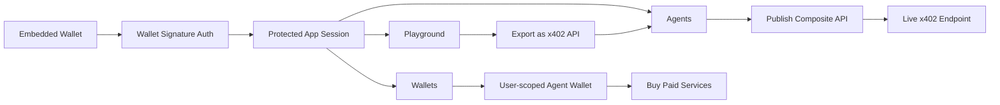

# Agent Bazaar Showcase

## Executive Summary

Agent Bazaar is a CDP-native machine commerce platform that combines:

- embedded wallet onboarding
- authenticated app sessions backed by wallet signatures
- user-scoped agent wallets
- x402 buying and selling
- AI-driven composite API creation
- durable telemetry and portfolio tracking

The result is a product that demonstrates how users and autonomous agents can both participate in programmable commerce onchain.

## Why the system is advanced

- It separates wallet sign-in from app-session authorization, which is critical for production-safe API access.
- It persists a dedicated server wallet per user and per network, rather than reusing a single global agent wallet.
- It turns chat exploration into a composable developer workflow: discover services, experiment, export a draft, publish an x402 API.
- It combines machine-commerce primitives with real product concerns: auth, persistence, search, pagination, theme preferences, onboarding, and documentation.

## Core System Overview

## End-to-End Demo Flow

1. Sign in with the embedded wallet.
2. Authenticate the app session by signing a wallet message.
3. Complete registration with display name, preferred network, and theme.
4. Open Playground and inspect the user wallet + agent wallet capabilities.
5. Discover x402 services from Bazaar and local premium endpoints.
6. Buy or test a service.
7. Export the conversation as a composite x402 API draft.
8. Refine the draft in Agents and publish it.
9. Open Wallets to show tracked assets, transfers, and the agent wallet.
10. Open Dashboard to show telemetry and activity.

## Strong Talking Points

- “This is not just wallet auth or just a chatbot. It’s a machine-commerce platform with both buyer and seller behavior.”
- “The server wallet is user-scoped and persisted per network, which makes the architecture much closer to a real product.”
- “The platform treats x402 APIs as composable building blocks, not isolated endpoints.”
- “The system includes security, persistence, onboarding, network preferences, and observability rather than stopping at a raw demo.”
